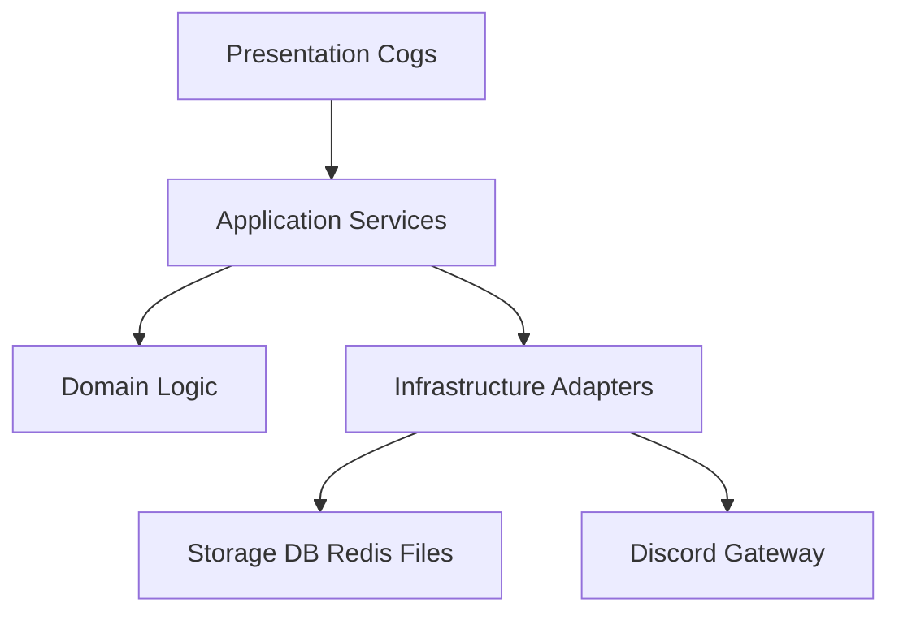

# План комплексного рефакторинга архитектуры

Цель: перейти к слоистой структуре с четкими границами ответственности и единым слоем доступа к данным, без микросервисов.

## Текущее положение

- Точка входа и оркестрация в [`bot.py`](../bot.py:1)
- Команды частично в когах ([`cogs/commands.py`](../cogs/commands.py:1), [`cogs/events.py`](../cogs/events.py:1)), частично в сервисах через `bot.tree` ([`automod.py`](../automod.py:1), [`moderation.py`](../moderation.py:1))
- Данные в разрозненных источниках: SQLite через [`database/db.py`](../database/db.py:1), JSON-конфиги ([`automod.py`](../automod.py:1), [`tickets.py`](../tickets.py:1))
- Инициализация мониторинга на уровне импорта ([`utils/monitoring.py`](../utils/monitoring.py:1))

## Целевая модель слоев



## Целевая структура пакетов

```
mee6/
├── app/                     # Точка входа, DI-контейнер
│   ├── bot.py
│   └── container.py
├── presentation/            # Коги и команды Discord
│   ├── commands.py
│   ├── events.py
│   ├── moderation.py
│   ├── automod.py
│   ├── tickets.py
│   └── voice.py
├── application/             # Сервисы и use-cases
│   ├── moderation_service.py
│   ├── automod_service.py
│   ├── leveling_service.py
│   ├── tickets_service.py
│   └── logging_service.py
├── domain/                  # Чистая логика и политики
│   ├── automod_policy.py
│   ├── leveling_rules.py
│   └── ticket_rules.py
├── infrastructure/          # Адаптеры БД/Redis/Файлы/Discord
│   ├── db/                  # SQLite + репозитории
│   ├── cache/               # Redis адаптер
│   ├── config/              # Единый конфиг и хранилище
│   └── monitoring/          # Инициализация метрик
└── utils/
```

## TODO план по этапам

### Этап 1. Базовая структура и DI
- [ ] Создать пакеты `app`, `presentation`, `application`, `domain`, `infrastructure`.
- [ ] Вынести запуск бота в [`app/bot.py`](../bot.py:1) и добавить контейнер зависимостей в [`app/container.py`](../bot.py:1).
- [ ] Перевести ленивые свойства `Bot` на явную инициализацию через контейнер.

### Этап 2. Команды только в когах
- [ ] Перенести регистрацию команд из [`automod.py`](../automod.py:1) и [`moderation.py`](../moderation.py:1) в коги `presentation`.
- [ ] Сервисы оставить чистыми: без `bot.tree` и без `discord.Interaction`.

### Этап 3. Единый слой данных
- [ ] Ввести репозитории (LevelsRepository, TicketsRepository, WarningsRepository).
- [ ] Перенести SQL-логику из [`leveling_system.py`](../leveling_system.py:1) в инфраструктурный слой.
- [ ] Оставить JSON только как миграционный fallback, вынести в `infrastructure/config`.

### Этап 4. Конфиг и мониторинг
- [ ] Централизовать конфиги (automod, tickets, env) в `infrastructure/config`.
- [ ] Отложить инициализацию Sentry/Prometheus до запуска приложения (убрать сайд-эффекты импорта).

### Этап 5. Контракты и критерии готовности
- [ ] Определить интерфейсы сервисов и репозиториев.
- [ ] Обновить импорты и тесты.
- [ ] Критерии: бот стартует, команды регистрируются, уровни/тикеты/логирование работают, JSON fallback сохранен.

## Риски и меры

- Риск: разрыв старых импортов. Мера: временные адаптеры и re-export модули.
- Риск: расхождение данных JSON и SQLite. Мера: однонаправленная миграция при старте.

